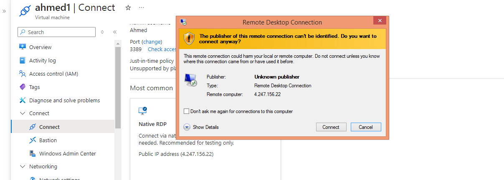

# Azure-load-balancer

## Objective
Azure Load Balancer ensures efficient traffic distribution, high availability, and scalability by balancing network traffic across multiple VMs. It improves performance, enhances security, supports global resilience, and monitors backend health. It enables both public (internet-facing) and internal load balancing for optimized application delivery.

## What is Azure Load-Balancer
Azure Load Balancer is a cloud service that distributes network traffic across multiple VMs to ensure high availability, scalability, and reliability. It supports both public (internet-facing) and internal (private network) load balancing, with health monitoring and automatic failover for optimized performance.

## How it works
#### Traffic Reception – It receives incoming network traffic (public or internal).
#### Rule-Based Distribution – Uses load-balancing rules to distribute traffic across backend virtual machines (VMs) in a pool.
#### Health Probes – Continuously checks the health of backend VMs and removes unhealthy ones from traffic routing.
#### Automatic Failover – Redirects traffic to healthy VMs if one fails, ensuring high availability.
#### Scalability Support – Works with Azure Autoscale to dynamically add or remove VMs based on demand.

## Summary
Azure Load Balancer is a cloud-based service that distributes incoming network traffic across multiple virtual machines (VMs) to ensure high availability, reliability, and scalability of applications.

### Key Features:
#### Traffic Distribution: Spreads incoming traffic across backend VMs to optimize performance.
#### High Availability: Ensures application reliability by rerouting traffic if a VM becomes unavailable.
#### Public & Internal Load Balancing:
#### Public Load Balancer: Distributes traffic from the internet to VMs.
#### Internal Load Balancer: Balances traffic within an Azure Virtual Network.
#### Health Probes: Monitors the health of backend VMs and removes unhealthy instances from the rotation.
#### NAT (Network Address Translation) Rules: Allows direct access to specific VM instances for maintenance or management.
#### Cross-region Load Balancing: Routes traffic across multiple Azure regions for global redundancy.

## Step-1
Creating 2 VMs
Creating first VM
##### *Keep in Availability set*

Create an availability set with any name of your choice

Select the ports

Proceed with 'Review and Create'
#### *Create another VM machine with same configuration and ensure both VMs are deployed in same availability set and resource group*

## Step-2
Connect your first VM

Download the RDP file

#### *Do similar for the 2nd VM*

